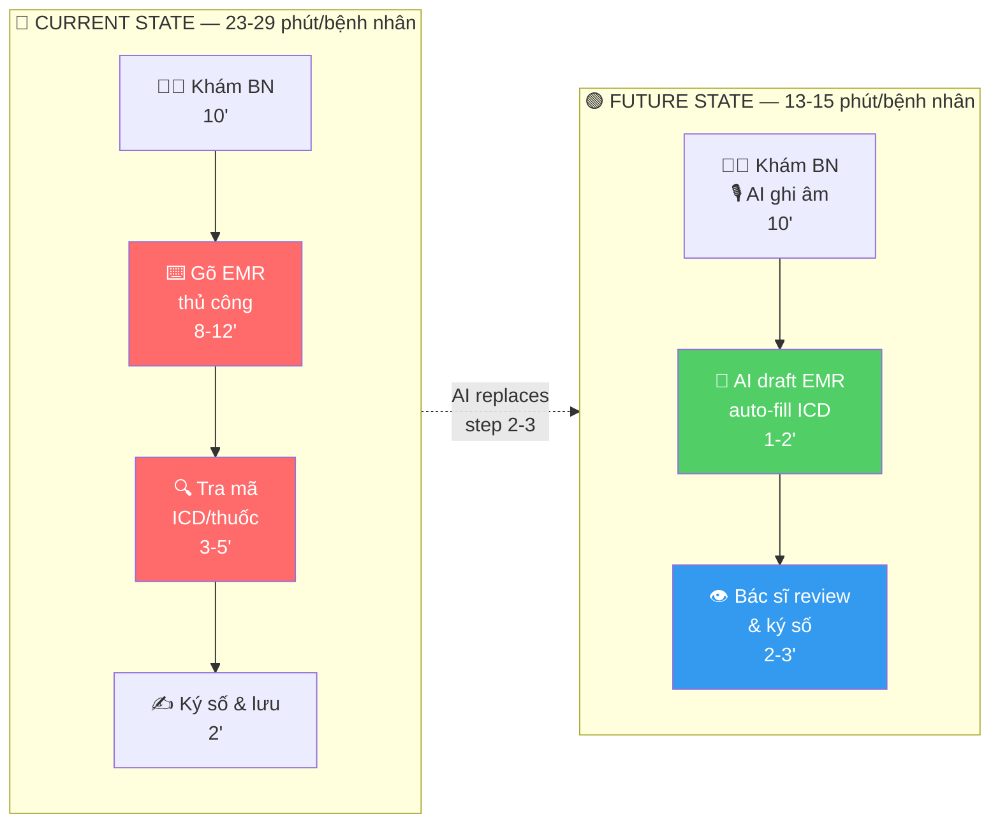
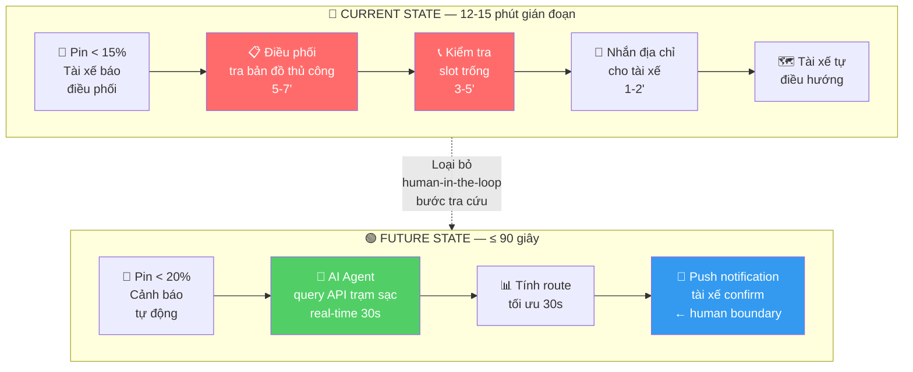
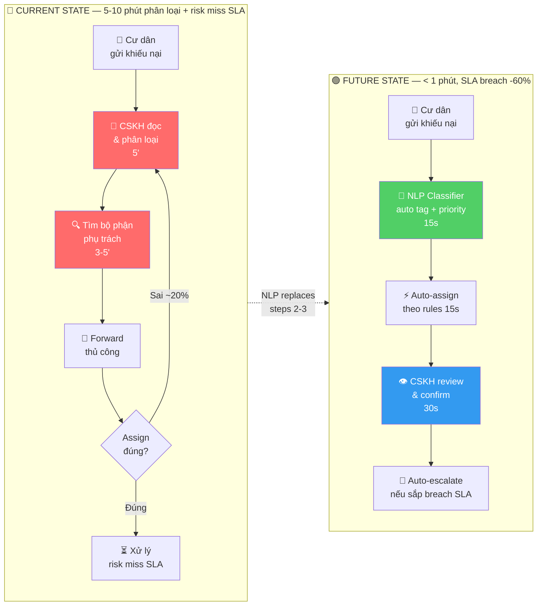

# 01 — Individual Problem Scan
> **Môi trường:** Hệ sinh thái Vingroup (VinFast · Vinhomes · Vinmec · Vinpearl · GSM/Xanh SM)
> **Nguồn dữ liệu:** Vin_Smart_Future_Problem_Lenses.xlsx + desk research

---

## Thông tin cá nhân

- **Họ và tên:** _Phạm Thành Trung_
- **Mã học viên:** _2A202602949_
- **Vai trò / bối cảnh:** Phân tích viên chiến lược / nghiên cứu hệ sinh thái Vingroup
- **Công việc hằng tuần (để soi problem):**
  - Tổng hợp báo cáo vận hành từ nhiều mảng (Vinhomes BQL, VinFast QC, GSM điều phối)
  - Review ticket CSKH và phân loại khiếu nại từ cư dân / khách hàng
  - Theo dõi KPI dashboard và cập nhật slide cho CEO/Board
  - Điều phối lịch ca, giám sát SLA dịch vụ nội bộ
  - Lắng nghe mạng xã hội và xử lý khủng hoảng truyền thông

---

## Phase 1 — Scan 25 Problems (toàn bộ dữ liệu từ file Excel)

> **Cách đọc bảng:** mỗi dòng = việc gì + ai chịu + đo bằng gì.  
> Cột `Dấu hiệu thật` bắt buộc có số: mất bao lâu, mấy lần/tuần, bao nhiêu người gặp.

| #  | Lăng kính | Problem quan sát được | Ai chịu ảnh hưởng? | Dấu hiệu thật (số + bằng chứng) |
|----|-----------|-----------------------|--------------------|----------------------------------|
| 1  | 🔁 Lặp lại | Mỗi thứ Hai tổng hợp Weekly Report từ Jira, Sheets, Slack | PM, EM, CEO | ~90 phút/tuần × 52 tuần = 78 giờ/năm/người |
| 2  | 🔁 Lặp lại | Copy sprint velocity từ Jira vào slide update | PM | Lặp lại mỗi tuần, thao tác tay 100% |
| 3  | ⏰ Tốn thời gian | Review PRD 10-15 trang trước khi comment | PM reviewer, Design Lead | 45 phút/bản × 3-4 bản/tuần = ~3 giờ/tuần |
| 4  | ⏰ Tốn thời gian | Viết meeting notes sau cross-team meeting | PM, team member | 30 phút/buổi × 8 buổi/tuần = 4 giờ/tuần |
| 5  | 🤖 AI có thể tốt hơn | Notion không gợi ý priority theo deadline/context | PM, team member | Task nhiều nhưng priority mờ hồ → trễ deadline |
| 6  | 🤖 AI có thể tốt hơn | Slack search tìm decision cũ rất khó | Cả team | 10-15 phút/lần tìm × nhiều lần/ngày |
| 7  | 😣 Pain từ người khác | Designer phải hỏi lại vì spec từ PM mập mờ | Designer, PM | Hỏi lại 2-3 lần/spec → delay sprint |
| 8  | 😣 Pain từ người khác | CEO hỏi update nhưng report chưa sẵn | CEO, PM | Hay bị trễ deadline thứ Hai |
| 9  | ⏰ Tốn thời gian | Tổng hợp monthly KPI từ nhiều dashboard | PM, Manager | Lặp lại mỗi tháng, ~2-3 giờ/lần |
| 10 | 🔁 Lặp lại | Viết standup update mỗi sáng cùng format | PM | 5-10 phút/ngày × 250 ngày = ~40 giờ/năm |
| 11 | 🔁 Lặp lại | Đối soát hóa đơn điện, nước, phí dịch vụ hàng tháng của hàng ngàn căn hộ Vinhomes | Kế toán, BQL Vinhomes | Dễ sai sót, tốn hàng tuần/tháng |
| 12 | ⏰ Tốn thời gian | Phân loại và định tuyến (route) ticket khiếu nại của cư dân (NSHCĐ, máy lạnh) | CSKH Vinhomes | Chậm trễ SLA 30 ngày → khiếu nại leo thang |
| 13 | 🤖 AI có thể tốt hơn | Bật/tắt điện và máy lạnh khu tiện ích chung theo lịch cứng thay vì lưu lượng người | BQL, Cư dân Vinhomes | Lãng phí 20-30% điện năng/tháng |
| 14 | 😣 Pain từ người khác | Hệ thống thang máy, PCCC hỏng đột xuất, cư dân phàn nàn gay gắt | Cư dân, BQL Vinhomes | Chi phí sửa chữa khẩn cấp cao, rủi ro an toàn |
| 15 | 🤖 AI có thể tốt hơn | Trợ lý ảo Vivi (VinFast) trả lời rập khuôn, thiếu ngữ cảnh cá nhân hóa | Tài xế, VinFast | Trải nghiệm cứng nhắc, bức bội |
| 16 | ⏰ Tốn thời gian | Bác sĩ phải tự gõ hồ sơ bệnh án (EMR) sau mỗi lượt khám | Bác sĩ Vinmec | Tốn 30-40% thời gian làm việc của bác sĩ |
| 17 | 🔁 Lặp lại | Xếp lịch ca làm cho hàng ngàn nhân viên buồng phòng theo lưu lượng khách biến động | HR, Manager Vinpearl | Mất nhiều giờ mỗi ngày xếp tay |
| 18 | 😣 Pain từ người khác | Tài xế Xanh SM báo hết pin, chờ điều phối viên tra cứu thủ công trạm sạc | Tài xế, CSKH Xanh SM | 12-15 phút/lần hỗ trợ × hàng trăm lần/ngày |
| 19 | 🤖 AI có thể tốt hơn | Kiểm tra lỗi thân vỏ xe/sơn trên dây chuyền bằng mắt thường | Kỹ sư QC VinFast | Lọt lỗi (defect), tốn nhân công kiểm tra |
| 20 | ⏰ Tốn thời gian | Lắng nghe mạng xã hội, đọc thủ công từng bình luận bức xúc của cư dân | CSKH, Truyền thông Vinhomes | Mất 2-3 nhân sự trực hằng ngày |
| 21 | 😣 Pain từ người khác | Khách hàng chờ đợi lâu để gọi xe tại các khu đô thị lớn giờ cao điểm | Khách hàng GSM | Tỷ lệ hủy chuyến cao → doanh thu mất |
| 22 | 🔁 Lặp lại | Lập báo giá và đối soát các hợp đồng dịch vụ thuê ngoài (hái xoài, dạy bơi) | Ban Kiểm soát nội bộ | Dễ thất thoát 15-25% quỹ dịch vụ |
| 23 | 🤖 AI có thể tốt hơn | Đánh giá chất lượng phục vụ của tài xế Xanh SM chỉ qua rating sao | Tài xế, Quản lý GSM | Thiếu feedback cụ thể, khó training |
| 24 | ⏰ Tốn thời gian | Kỹ thuật viên tra cứu mã lỗi hiểm trong tài liệu sửa chữa xe hàng nghìn trang | Kỹ thuật viên VinFast | Kéo dài thời gian xe nằm xưởng → chi phí |
| 25 | 😣 Pain từ người khác | Cư dân tranh cãi quyền sử dụng tiện ích (bóng bàn) do lịch xếp thủ công thiếu minh bạch | Cư dân, BQT Vinhomes | Khiếu kiện, khủng hoảng truyền thông |

> **Phân bổ theo lăng kính:**
> - 🔁 Lặp lại: #1, #2, #10, #11, #17, #22 — **6 problems**
> - ⏰ Tốn thời gian: #3, #4, #9, #12, #16, #20, #24 — **7 problems**
> - 🤖 AI có thể tốt hơn: #5, #6, #13, #15, #19, #23 — **6 problems**
> - 😣 Pain từ người khác: #7, #8, #14, #18, #21, #25 — **6 problems**

**AI đã dùng ở Phase 1:**
- **Prompt đã hỏi:** "Scan môi trường Vingroup qua 4 lenses: Lặp lại / Tốn thời gian / AI có thể tốt hơn / Pain từ người khác"
- **Ý dùng được:** Các pain point về EMR Vinmec (#16), QC VinFast (#19), điều phối Xanh SM (#18)
- **Ý bỏ vì không phải pain thật:** Một số gợi ý về marketing automation — quá rộng, không đo được

**Self-check Phase 1:**
- [x] Đủ 5+ dòng (có 25 dòng), mỗi dòng có actor + số đo cụ thể
- [x] Dùng đủ 4/4 lăng kính
- [x] Không có dòng chung chung kiểu "mất nhiều thời gian"

---

## Phase 2 — Top 3 Problem Cards

### 2.1. Chọn Top 3

| Rank | Problem (copy từ bảng scan) | Vì sao chọn (2-3 ý) | Điều còn chưa chắc |
|------|-----------------------------|---------------------|--------------------|
| 1 | **#16** — Bác sĩ Vinmec tự gõ EMR sau mỗi lượt khám (⏰ Tốn thời gian) | Actor cụ thể (bác sĩ), impact đo được (30-40% thời gian), AI voice-to-text đã proven | Quy định pháp lý về hồ sơ y tế điện tử; độ chính xác thuật ngữ chuyên khoa |
| 2 | **#18** — Tài xế Xanh SM báo hết pin, điều phối tra cứu thủ công trạm sạc (😣 Pain) | Pain real-time rõ ràng, 12-15 phút/lần × hàng trăm lần/ngày, AI routing đã có precedent | Dữ liệu real-time trạm sạc có sẵn không? API có mở không? |
| 3 | **#12** — Phân loại & định tuyến ticket khiếu nại cư dân Vinhomes (⏰ Tốn thời gian) | SLA 30 ngày là KPI đo được, NLP phân loại ticket đã mature, actor rõ (CSKH Vinhomes) | Ngôn ngữ khiếu nại cư dân đa dạng; cần training data |

---

### 2.2. Problem Cards Chi Tiết

---

#### Problem Card #1 — Bác Sĩ Vinmec Gõ EMR Thủ Công

```text
Problem 1 câu:
  Bác sĩ Vinmec mất 30-40% thời gian làm việc để tự gõ hồ sơ bệnh án sau mỗi lượt
  khám, trong khi AI voice-to-text có thể thay thế phần lớn tác vụ này.

Actor:
  Bác sĩ lâm sàng Vinmec (ước tính 3.000+ bác sĩ toàn hệ thống)

Thời điểm / bối cảnh:
  Sau mỗi lượt khám (5-15 phút/lượt), bác sĩ quay lại máy tính gõ thông tin
  bệnh nhân, chẩn đoán, đơn thuốc vào hệ thống EMR — thay vì dành thêm
  thời gian cho bệnh nhân tiếp theo.

Current workflow 3-7 bước:
  1. Khám bệnh nhân, nói chuyện trực tiếp (~10 phút)
  2. Bệnh nhân ra ngoài, bác sĩ gõ EMR thủ công (~8-12 phút)  ← BOTTLENECK
  3. Tra cứu tên thuốc, mã ICD trong dropdown (~3-5 phút)       ← BOTTLENECK
  4. Ký số hồ sơ, lưu vào hệ thống (~2 phút)
  5. Gọi bệnh nhân tiếp theo — tổng chu kỳ: 23-29 phút/bệnh nhân

Bottleneck:
  Bước 2-3 (gõ EMR + tra mã ICD) — chiếm 30-40% tổng thời gian chu kỳ khám

Impact:
  - Năng suất: bác sĩ khám được ít bệnh nhân hơn 30-40%
  - Chất lượng: bác sĩ mệt mỏi → tăng lỗi nhập liệu
  - Chi phí: Vinmec phải thuê thêm nhân lực hoặc tăng ca

Success metric:
  - Thời gian gõ EMR/lượt khám giảm từ ~10 phút xuống ≤ 2 phút
  - Tỷ lệ lỗi nhập liệu giảm ≥ 50%
  - Số bệnh nhân/ngày/bác sĩ tăng ≥ 20%

Non-AI alternative:
  Thuê thêm y tá hành chính gõ hộ (tốn chi phí nhân sự, vẫn có độ trễ)

AI hypothesis:
  AI voice-to-text (speech-to-text + NLP y tế) nghe cuộc khám, tự điền
  vào form EMR theo template chuẩn; bác sĩ chỉ review & ký số.

Quick gut:
  [ ] No AI / process fix
  [ ] Rule
  [x] Workflow (AI + human review)
  [ ] Agent
  [ ] Chưa biết
```

**Draft workflow Card #1** (Mermaid):



```
CURRENT STATE — 23-29 phút

[1 Khám BN: 10'] → [2 Gõ EMR thủ công: 8-12'] ← BOTTLENECK
                  → [3 Tra mã ICD: 3-5']       ← BOTTLENECK
                  → [4 Ký số: 2']

FUTURE STATE — 13-15 phút

[1 Khám BN + AI ghi âm: 10'] → [2 AI draft EMR: 1-2']
                              → [3 Bác sĩ review & ký số: 2-3'] ← human boundary

Fallback: Nếu AI transcribe sai (thuật ngữ hiếm, tiếng địa phương)
→ Bác sĩ sửa trực tiếp trên bản draft; log correction làm training data
→ Không có output nào được lưu mà chưa qua human review
```

---

#### Problem Card #2 — Tài Xế Xanh SM Hết Pin, Điều Phối Tra Cứu Thủ Công

```text
Problem 1 câu:
  Khi tài xế Xanh SM báo hết pin, điều phối viên phải tra cứu thủ công trạm
  sạc gần nhất (12-15 phút/lần), gây gián đoạn dịch vụ và giảm hiệu suất đội xe.

Actor:
  Tài xế Xanh SM + Điều phối viên CSKH GSM

Thời điểm / bối cảnh:
  Xảy ra nhiều lần/ngày, đặc biệt giờ cao điểm (7-9h, 17-20h) khi xe
  đang chạy chuyến hoặc vừa hoàn thành chuyến cuối trước khi hết pin.

Current workflow 3-7 bước:
  1. Tài xế nhận thông báo pin thấp (<15%), gọi/chat điều phối
  2. Điều phối mở bản đồ thủ công tìm trạm sạc gần nhất   ← BOTTLENECK
  3. Điều phối kiểm tra slot sạc còn trống (gọi/sheet)    ← BOTTLENECK
  4. Điều phối nhắn tài xế địa chỉ trạm
  5. Tài xế điều hướng thủ công đến trạm
  Tổng: 12-15 phút — xe không chạy chuyến trong thời gian này

Bottleneck:
  Bước 2-3: Điều phối tra cứu thủ công + xác nhận slot — chiếm 8-10 phút

Impact:
  - Xe không hoạt động 12-15 phút × nhiều lần/ngày × toàn đội xe
  - CSKH phải xử lý complaint từ khách bị hủy chuyến
  - Chi phí vận hành tăng do non-productive time

Success metric:
  - Thời gian từ báo pin thấp đến tài xế biết địa chỉ trạm: ≤ 90 giây
  - Tỷ lệ xe phải dừng khẩn cấp do hết pin: giảm ≥ 70%
  - Tỷ lệ slot sạc được dự báo chính xác: ≥ 90%

Non-AI alternative:
  Quy trình bắt buộc tài xế tự sạc khi pin < 20% (rule-based), nhưng
  vẫn cần biết slot sạc nào trống.

AI hypothesis:
  Agent AI tự động: nhận tín hiệu pin thấp từ xe → query API trạm sạc
  real-time → tính route tối ưu (pin đủ đến trạm, không lệch quá nhiều)
  → push notification trực tiếp cho tài xế, không qua điều phối.

Quick gut:
  [ ] No AI / process fix
  [ ] Rule
  [ ] Workflow
  [x] Agent (autonomous routing)
  [ ] Chưa biết
```

**Draft workflow Card #2** (Mermaid):



```text
CURRENT STATE — 12-15 phút

[1 Tài xế báo] → [2 Điều phối tra bản đồ: 5-7'] ← BOTTLENECK
               → [3 Check slot trống: 3-5']       ← BOTTLENECK
               → [4 Nhắn địa chỉ: 1-2'] → [5 Tài xế điều hướng]

FUTURE STATE — ≤ 90 giây

[1 Pin < 20% auto-trigger] → [2 AI query API real-time: 30s]
                           → [3 Route tối ưu: 30s]
                           → [4 Push notification tài xế confirm] ← human boundary

Fallback: Nếu API trạm sạc down hoặc không có slot
→ AI escalate sang điều phối viên với context đầy đủ
→ Điều phối chỉ cần quyết định, không cần tra cứu từ đầu
```

---

#### Problem Card #3 — Phân Loại & Định Tuyến Ticket Khiếu Nại Cư Dân Vinhomes

```text
Problem 1 câu:
  CSKH Vinhomes phân loại và định tuyến ticket khiếu nại thủ công dẫn đến
  SLA 30 ngày bị trễ, leo thang khiếu kiện và rủi ro truyền thông.

Actor:
  Nhân viên CSKH Vinhomes + BQL tòa nhà

Thời điểm / bối cảnh:
  Cư dân gửi khiếu nại qua Zalo/app/hotline về: PCCC, thang máy, điện,
  nước, ồn ào hàng xóm, tiện ích… CSKH đọc, phân loại, assign thủ công
  → gửi email/Zalo cho bộ phận kỹ thuật tương ứng.

Current workflow 3-7 bước:
  1. Cư dân gửi khiếu nại (Zalo/app/hotline)
  2. CSKH đọc nội dung, phân loại danh mục   ← BOTTLENECK
  3. CSKH tìm đúng bộ phận phụ trách         ← BOTTLENECK
  4. CSKH forward/assign ticket kèm ghi chú
  5. Bộ phận xử lý — thỉnh thoảng assign nhầm → forward lại từ đầu
  6. CSKH follow-up thủ công nếu quá hạn SLA
  7. Đóng ticket, báo cư dân

Bottleneck:
  Bước 2-3: Phân loại + tìm đúng route — dễ sai, phải forward lại
  Bước 5-6: Không có auto-escalation → SLA miss

Impact:
  - SLA 30 ngày thường xuyên bị trễ
  - Khiếu nại leo thang lên mạng xã hội → khủng hoảng truyền thông
  - CSKH quá tải với volume ticket cao

Success metric:
  - Thời gian phân loại + assign ticket: < 1 phút (từ 5-10 phút thủ công)
  - First-assignment accuracy: ≥ 90%
  - SLA breach rate giảm ≥ 60% trong 3 tháng đầu triển khai

Non-AI alternative:
  Standardize form khiếu nại với dropdown danh mục → cư dân tự chọn
  (giảm effort classify nhưng vẫn không auto-route)

AI hypothesis:
  NLP classifier đọc nội dung khiếu nại → tự gán danh mục + priority
  + assign đúng bộ phận; auto-escalate nếu sắp breach SLA.

Quick gut:
  [ ] No AI / process fix
  [ ] Rule
  [x] Workflow (NLP + rule-based escalation)
  [ ] Agent
  [ ] Chưa biết
```

**Draft workflow Card #3** (Mermaid):



```text
CURRENT STATE — 5-10 phút

[1 Cư dân gửi] → [2 CSKH phân loại: 5'] ← BOTTLENECK
               → [3 Tìm bộ phận: 3-5']   ← BOTTLENECK
               → [4 Forward] → [5 Xử lý]

FUTURE STATE — < 1 phút

[1 Cư dân gửi] → [2 NLP classifier: 15s] → [3 Auto-assign: 15s]
              → [4 CSKH review & confirm: 30s] ← human boundary
              → [5 Auto-escalate nếu sắp breach SLA]

Fallback: Nếu NLP confidence < 70% (khiếu nại mơ hồ, nhiều vấn đề)
→ Route sang CSKH senior, kèm top-3 AI suggestions
→ Correction được log lại làm training data cải thiện model
```

---

### 2.3. Card Muốn Pitch Nhất (chuẩn bị 2 phút)

**Card tôi muốn pitch nhất:** `Card #1 — Bác sĩ Vinmec gõ EMR thủ công`

```text
Card #1 — AI Voice-to-EMR cho Bác Sĩ Vinmec
```

**Vì sao (2-3 câu: workflow gì, số đo gì, impact gì):**

```text
Workflow khám bệnh tại Vinmec có 1 bottleneck chiếm 30-40% thời gian bác sĩ
— bước gõ EMR thủ công sau mỗi lượt khám. Với 3.000+ bác sĩ, giải quyết
bottleneck này có thể tiết kiệm hàng triệu phút làm việc/năm và tăng capacity
khám bệnh ≥20% mà không cần tuyển thêm. AI voice-to-text + NLP y tế là công
nghệ đã proven (Suki AI, Nuance DAX) — điều cần làm là adapt cho ngữ cảnh
tiếng Việt + danh mục ICD tiếng Việt của Vinmec.
```

**Câu hỏi tôi muốn nhóm challenge (1-2 câu hỏi đúng chỗ yếu):**

```text
1. Quy định pháp lý của Bộ Y tế về hồ sơ bệnh án điện tử có cho phép AI
   tự động điền không, hay bắt buộc bác sĩ nhập tay từng trường?

2. Độ chính xác speech-to-text cho thuật ngữ y khoa tiếng Việt hiện tại
   là bao nhiêu — liệu có đủ để bác sĩ tin tưởng review thay vì gõ lại hoàn toàn?
```

**AI phản biện Card:**
- **Điểm yếu AI chỉ ra:** Rủi ro pháp lý (Medical records compliance), rủi ro privacy, độ chính xác thuật ngữ chuyên khoa thấp hơn general speech.
- **Tôi sửa gì:** Thêm "Non-AI alternative" rõ hơn, nhấn mạnh human boundary (bác sĩ phải ký số sau khi review), đề xuất pilot ở 1 khoa trước khi rollout toàn hệ thống.

---

### Self-check Nộp Phần 01

- [x] Có 25 problems (vượt yêu cầu 5+) + top 3 Cards đủ field
- [x] Mỗi Card có workflow trước/sau + bottleneck + metric + fallback
- [x] Đã chọn 1 card pitch (Card #1 — EMR Vinmec) + câu hỏi challenge

---

